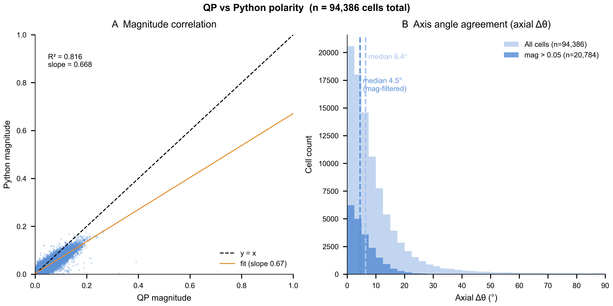

# QuantiPy Polarity

Single-shot planar cell polarity quantification from microscopy images — a Python reimplementation of the QuantifyPolarity Mathematica tool with end-to-end pipeline, migration-front detection, and an interactive viewer.

[](https://github.com/mcleanT/QuantiPy-Polarity/actions/workflows/ci.yml)
[](LICENSE)
[](https://www.python.org/downloads/)

## What it does

QuantiPy Polarity measures planar cell polarity on a cell-by-cell basis using a Fourier k=2 boundary PCA method: it fits a PCA ellipse to each cell's membrane signal in Fourier space and reports a magnitude (how polarized) and axis angle (which direction). Starting from raw microscopy files (TIF or ND2) or pre-computed label masks, the pipeline runs Cellpose-SAM segmentation, computes per-cell polarity vectors, detects migration fronts, aggregates results across fields of view, and produces publication-ready figures alongside a self-contained HTML report. All outputs are written in standard formats — per-cell measurements in Parquet, figures as PDF/PNG, and a single portable `report.html`. The method is marker-agnostic and works on any membrane-localized fluorescent signal.

## Validation

QuantiPy outputs are linearly related to QuantifyPolarity's per-cell polarity calls. The figure below shows the regression between QP (the canonical Mathematica tool) and our Python implementation on >94,000 real cells from a 25 h migration experiment (clones C10 + D11, 28 FOVs):



| Component | Metric | Value |
|---|---|---|
| Polarity magnitude | R² | **0.816** |
| Polarity magnitude | Slope (QP→Python) | 0.668* |
| Polarity axis | Median axial Δθ | **4.5°** |
| Polarity axis | Mean cos(2Δθ) | **0.965** |
| Polarity axis | Stokes R² (S₁/S₂) | **0.939 / 0.921** |

\*QP and Python use slightly different magnitude normalizations; the linear relationship is preserved.
Axis metrics computed on n=20,784 cells with qp_magnitude > 0.05 AND py_magnitude > 0.05 (well-polarised cells). **Naive Pearson R² on raw angles is the wrong metric for axial data** — polarity axes are defined mod 180°, so cells straddling the ±90° boundary appear ~180° apart in raw angle space but are only 2° apart physically. The correct approach is to compute axial Δθ (wrapping at 90°) and use the Stokes representation cos(2θ)/sin(2θ). Additionally, ~78% of cells have near-zero polarity magnitude and therefore meaningless axis angles; magnitude filtering is required before evaluating axis agreement.

**Note on magnitude slope:** QP consistently reports ~50% larger magnitudes than the Python implementation due to a normalization difference in the boundary-PCA algorithm. The linear relationship is preserved (slope 0.668, R²=0.816); magnitude values from the two tools should not be compared directly without applying this scaling.

Reproduce locally:

```bash
quantipy validate --output ./validation_out
```

## Quickstart

```bash
git clone https://github.com/mcleanT/QuantiPy-Polarity.git
cd QuantiPy-Polarity
pip install -e ".[dev,pipeline]"
quantipy download-demo
quantipy run --config ~/.cache/quantipy/demo/config.yaml --output ./results
open ./results/report.html
```

The `[pipeline]` extra adds `nd2reader`, `cellpose`, `matplotlib`, and `tqdm` for raw-image processing. The base install (`pip install -e .`) is sufficient for `masks` mode (pre-segmented inputs).

## Features

**Primary commands — everyday use**

- `quantipy run` — single-shot: raw input → all outputs (polarity, front, figures, report)
- `quantipy init-config` — scaffold a config YAML for `nd2`, `tif`, or `masks` input mode
- `quantipy download-demo` — pull the demo bundle (~5 MB synthetic cells) from GitHub Releases
- `quantipy validate` — regenerate the QP-vs-Python comparison figure from the bundled real 94k-cell dataset
- `quantipy debug` — write a self-contained per-cell HTML viewer for a completed run

**Advanced commands — per-stage control**

- `quantipy ingest` — ND2/TIF → normalized per-FOV TIFs
- `quantipy segment` — Cellpose-SAM → label masks
- `quantipy polarity` — label masks + membrane channel → per-cell polarity parquets
- `quantipy front` — migration-front detection
- `quantipy aggregate` — per-FOV parquets → experiment-level parquet
- `quantipy plot` — regenerate plots from aggregated parquet
- `quantipy report` — regenerate HTML report from a run directory
- `quantipy analyze` — curated experimental analyses (e.g., magnitude vs. distance from front)

**Pipeline resume**

| Flag | Behaviour |
|------|-----------|
| *(none)* / `--resume` | Skip stages already marked done; retry from the first failed stage |
| `--force` | Wipe all stage-status caches and re-run every stage from scratch |

## Architecture

```
raw microscopy → ingest → segment → polarity → front → aggregate → plot → report
  (TIF / ND2)    (tifs)   (masks)   (parquet)  (csv)   (parquet)  (PDF)  (HTML)
```

Each stage writes its outputs atomically and records its status in `_stage_status.json`, so interrupted runs resume cleanly.

## Documentation

| Document | Contents |
|----------|----------|
| [docs/concepts.md](docs/concepts.md) | Biological assumptions, Fourier k=2 boundary PCA method |
| [docs/pipeline.md](docs/pipeline.md) | Stage-by-stage description, run directory layout |
| [docs/cli-reference.md](docs/cli-reference.md) | All CLI commands, flags, and examples |
| [docs/api-reference.md](docs/api-reference.md) | Public Python API |
| [docs/migration-front.md](docs/migration-front.md) | Front detection algorithm |
| [docs/interactive-viewer.md](docs/interactive-viewer.md) | Per-cell viewer usage guide |
| [docs/validation.md](docs/validation.md) | QP-vs-Python comparison methodology and synthetic dataset |

## Citation

If you use QuantiPy Polarity in published work, please cite both this implementation and the original QuantifyPolarity:

```bibtex
@software{mclean_quantipy_polarity_2026,
  author  = {McLean, Taggart},
  title   = {{QuantiPy Polarity}},
  year    = {2026},
  version = {0.1.0},
  url     = {https://github.com/mcleanT/QuantiPy-Polarity},
  license = {MIT}
}
```

Please also cite the original QuantifyPolarity tool from the Hughes Lab, whose boundary-PCA algorithm this package reimplements.

## License

MIT — see [LICENSE](LICENSE).
